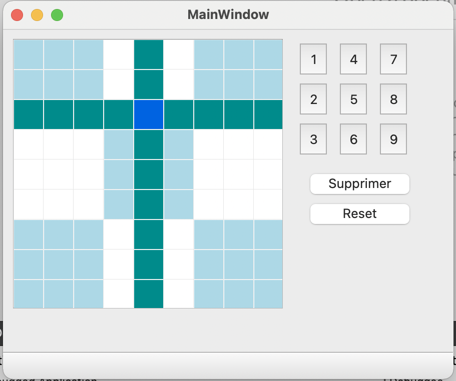
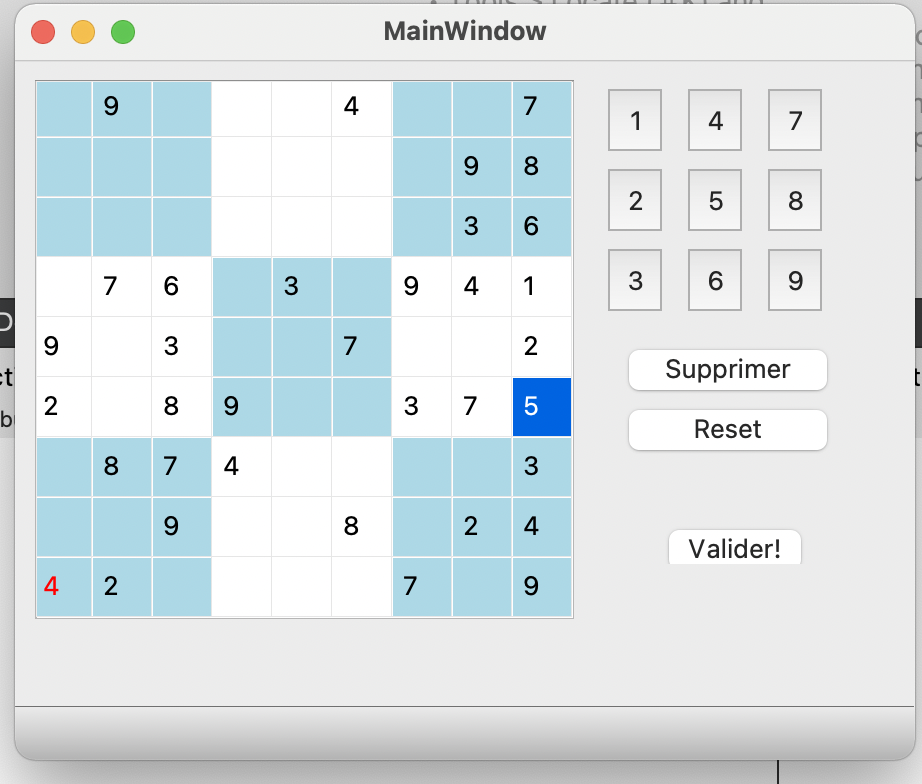

# Programmation des interfaces graphiques en C++ - Projet Sudoku 

Pour ce projet, nous avon développé une réplique du Sudoku avec Qt Creator. Pour cela, nous avons utilisé un fichier d'interface utilisateur (.ui), qui permet de créer des composants (widgets) avec Qt Designer, et des classes qui génèrent le code permettant de gérer les interactions entre les widgets. 

1. Fonctionnalités de base : 
- L'utilisateur peut positionner des chiffres dans une case en cliquant sur la case puis en cliquant sur l'un des 9 boutons chiffres sur la droite de la grille.  Le chiffre s'inscrit en couleur noramle que s'il respecte les règles classiques du sudoku : un chiffre ne doit apparaître qu’une seule fois dans chaque ligne, dans chaque colonne, et dans chaque bloc.
Si le chiffre n'est pas bien placé, alors il est écrit en rouge.

- La grille initiale est donnée dans un fichier .csv, le programme permet donc de récupérer le code afin de rentrer les chiffres donnés au départ dans la grille. 

- Le chiffre dans la grille peut être sretiré en cliquant sur le bouton "supprimer". Le chiffre peut aussi être remplacé en cliquant sur la case puis en cliquant sur l'un des 9 chiffres.

2. Fonctionnalités supplémentaires : 
- Pour choisir le niveau de la grille, il y a un menu déroulant. lorsque l'on clique sur un type de grille, la grille se remplit automatiquement avce les chiffres de la grille initiale.

- Un bouton Reset permet de supprimer tous les chiffres ajoutés par l'utilisateur pour revenir à la grille initiale. 

- Chaque fois que l'utilisateur clique sur une case, la ligne et la colonne apparaissent surlignées.

- Un bouton valider pour savoir si l'on a gagné. Si la partie est gagnée, toutes les cases se surlignent en vert.

3. Aspects techniques :
- Le fichier "mainwindow.ui" est un fichier Forms qui permet, grâce à Qt Designer, d'ajouter des widgets et de gérer l'interface graphique.

- La classe "mainwindow" composée d'un .cpp et d'un .h permet de gérer les clics sur les différents boutons grâce aux "slots". Elle initialise également la fenêtre. Les différentes fonctions comme celle qui permet de savoir si le chiffre est bien placé ou non sont codées dans cette classe.

- Dans les ressources, on a les .csv qui sont les grilles de différents niveaux. Il y a également 4 images (.png) qui permettent de faire les pastilles représentant le niveau des grilles dans le menu déroulant. 

# Quelques visuels : 

